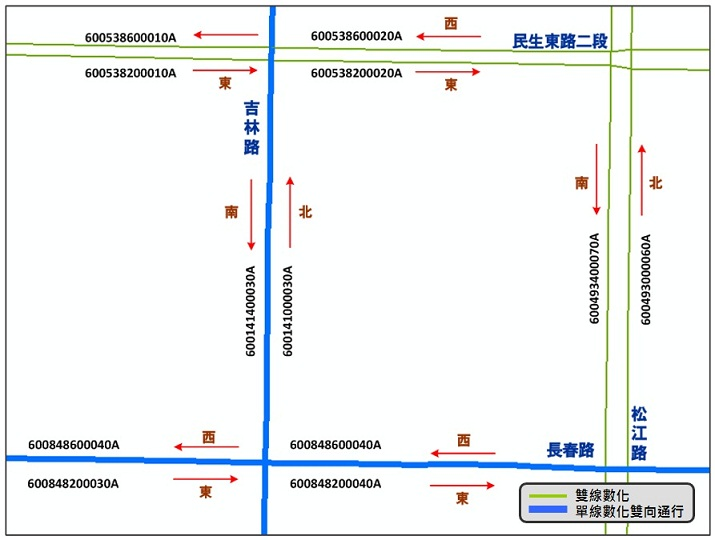

# 交通資訊路段編碼內容說明
## 路段編碼原則
  - 一般路段：分向不分道
  
    
 
    \*單行道：雙向編碼，惟status：不啟用。
    
    
  - 虛擬線段：不具實質意義，不編碼
  
    
  
    \*由人工挑選路口及迴轉道線段，並予以標註。
    
    
## 路段編碼說明

   
   
   紀錄於屬性欄位，以 N/NE/E/SE/S/SW/W/NW八方位碼表示。
   
   主要用於交通資訊分析及設施設置兩側的合理性檢核。
    
### 道路分類碼
  - 道路分類依臺灣通用電子地圖之道路等級碼為依據進行編碼。
  - 分類碼0至2為具有匝道之封閉型道路，3至6則為平面道路。
  
道路分類         | 簡稱  | 道路分類碼 | 臺灣通用電子地圖道路等級碼 | 道路等級碼中文名稱
:--------------:|:-----:|:---------:|:------------------------:|:---------------:
國道    | 國道 |  0 |    HW | 國道
省道快速公路    | 省快 | 1 |  1E | 省道快速公路
市區快速道路  | 市快 | 2 |  RE | 市區快速道路
省道一般公路  | 省道 | 3 |  1W/1U | 省道/省道共線
縣道、市道   | 縣道 | 4 |  2W/2U | 縣道/縣道共線
鄉道、區道   | 鄉道 | 5 |  3W/3U | 鄉道/鄉道共線
市區一般道路  | 市路 | 6 |  RD | 市區一般道路

### 路名碼
  - 每個道路有其專屬對應名稱與號碼。
  - 依道路分類各自編訂路名碼，市區道路又依所屬縣市各自道路名稱筆畫數排序編碼。

道路分類         |   編碼規則  |  範例
:--------------:|:------------|:-----
國道    | 前4碼為主線編碼，第5碼為支線編號(甲:1,乙:2) | 國1(00010)、國3甲(00031) 
省道快速公路  | 前4碼為主線編碼，第5碼為支線編號(甲:1,乙:2) | 台88(00880)、台74甲(00741) 
市區快速道路  | 前4碼為本案給定流水號，第5碼為支線編號 | 水源快速道路(00020)、市民大道高架道路(00040) 
省道一般公路  | 前4碼為主線編碼，第5碼為支線編號(甲:1,乙:2) | 台1(00010)、台1甲(00011) 
縣道、市道    | 前4碼為主線編碼，第5碼為支線編號(甲:1,乙:2) | 縣121(01210)、縣119甲(01191) 
鄉道、區道    | 第1碼為縣市碼，2~4碼為主線編碼，第5碼為支線編號(跨縣市以A、B、C順序依序表示，A:第一條跨縣市道路、B為第二條依序表示) | 中102(B1020)、中102-1(B1021) 
市區一般道路  | 5碼流水號，路名包含段數；各縣市有各自路名碼，而不同鄉鎮市區內之同名道路訂定不同之路名碼 | 忠孝東路(00111)、忠孝東路一段(00112) 

\*無名道路：暫由本案編訂，後續有官方正式公告路名將配合調整

  - 路名碼範例：圓環
  
  
  
  
### 道路特徵碼
  - 道路特徵碼﹕國道，省快，市快的交流道(匝道)之道路特徵碼為1，主線為0。
  - 其餘道路一般狀態下，道路特徵碼為0，但當同一路段同時有數個不同結構(相同路名)，則依實際狀態將地下道(或高架路段)設為主線，平面道路設為副線，或反之。
  
  
### 方向碼、方位碼
#### 道路「方向碼」與路段「方位碼」
  - 道路「方向」指連續同一路名道路起點至迄點全路段所產生之方向，通常由多個基礎路段所組成。
  - 路段「方位」則指每一個基礎路段產生之方位。
  
  - 方向碼：
  
    1. 公路：依道路里程遞增方向區分順逆，遞增為順向0、逆向1。
    
    2. 市區快速道路：依全路段走向判別，南北向及東西向為順向0，逆向1。
    
    3. 市區道路(一般)：依道路起迄點方向定義，共8個方向(0-7)。
    
    4. 市區道路(外環)：道路起迄相接，順逆時鐘分別以8,9表示。
    
    5. 市區道路(圓環)：道路起迄相接，以A表示方向碼。
   
  - 方位碼：記錄於屬性輔助表示各路段方位，以英文八方位簡碼表示。
  
  - 方向碼範例：市區快速道路
    市快匝道之方向碼，主要同上游主線；依全路段走向判別方向性，南北向及東西向為順向0，反之逆向1。
    
  - 方向碼範例：外環道、圓環
  
  - 方向碼範例：山區道路取主線
  
#### 序號碼
  - 同一道路多線段組成者依序編號給予唯一值。
  
  - 序號碼(含備用碼)：5碼，序號順序應具有道路上下游關係。
    
    1. 公路：以**里程**編碼，AAABB。
    
         (1) AAAK+BB里程紀錄至10公尺
      
         (2) 異動直接以里程表示新的段點，故仍具序號連續性的特性。
      
    2. 市區道路：以**流水號**編碼，AAAAB，B為異動備用碼。
    
         (1) 編碼序號以00000,00010,00020……，可視為1組十位數號碼。
      
         (2) 異動時啟動個位數序號，以保持序號連續性的特性。
      
    3. 匝道：以**流水號**編碼，AABBC。
    
         (1) AA為交流道編號，BB為匝道流水號，C為異動備用碼。
      
         (2) 編碼序號以01000,01010,01020,……，可視為1組十位數號碼。
      
         (3) 異動時啟動個位數序號，以保持序號連續性的特性。
      
   - 市區道路序號碼內之「異動備用碼」：AAAAB，B為異動備用碼。
   
     1. 為1碼數字，市區道路路段更新時使用，其與序號碼最後一碼可視為1組十位數號碼，使於節點增刪後亦可顯示其編號順序性。
     
     2. 新增節點1點時，備用碼為3, 6；新增2點時為3, 6, 8。
     
     3. 刪除節點1點時，備用碼為前後節點之平均。刪除2節點時則為前後節點之平均再加5。
     
   - 序號碼範例：公路、市區道路、圓環
   
   - 序號碼範例：高快速公路交流道
   
     1. 前兩碼為交流道編號，後兩碼為匝道流水號遇分叉時右側優先。
     
     2. 系統交流道歸屬不同交流道分別依原則編號。
     
   - 序號碼範例：市區快速道路匝道
   
     1. 前兩碼為市快交流道編號，後兩碼為匝道流水號。
     
     2. 依匝道出入口判斷，先編出口再編入口。
     
     3. 里程遞增遞減方向判斷，里程遞增先編，反之遞減後編。
     
#### 縣市碼
  - 為路段所在縣市之代碼，其值與地政司縣市代碼一致，為大寫英文字母[A~Z] (L、R、S、Y保留)。

縣市名 | 縣市碼  | 縣市名 | 縣市碼
:-----:|:------:|:-----:|:------:
台北市 |   A   |  苗栗縣  |  K
台中市 |   B   |  南投縣  |  M
基隆市 |   C   |  彰化縣  |  N
台南市 |   D   |  新竹市  |  O
高雄市 |   E   |  雲林縣  |  P
新北市 |   F   |  嘉義縣  |  Q
宜蘭縣 |   G   |  屏東縣  |  T
桃園市 |   H   |  花蓮縣  |  U
嘉義市 |   I   |  台東縣  |  V
新竹縣 |   J

#### 補充：RoadID與LinkID關係說明

  - LinkID = 基礎路段代碼

  - RoadID = 道路代碼
     > 公      路：RoadClass (1碼)+RoadNameID(5碼)
     
     > 市區道路(含市快)：RoadClass (1碼)+RoadNameID(5碼)+CityID(1碼)
