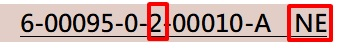
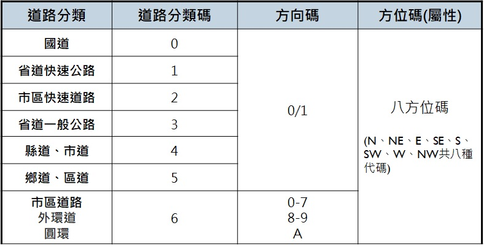
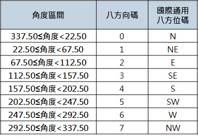
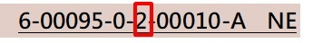
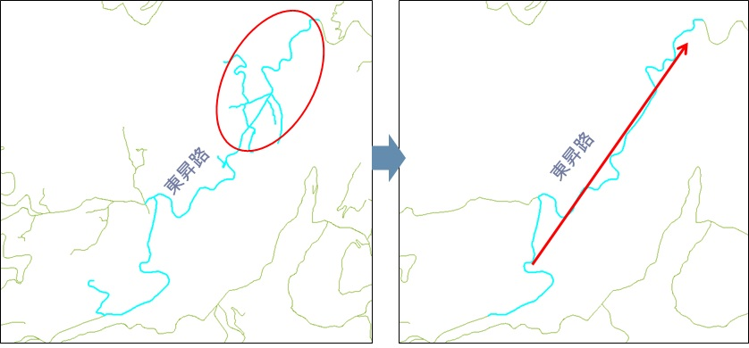

# 方向碼及方位碼

## 道路「方向碼」與路段「方位碼」

* 道路「方向」指連續同一路名道路起點至迄點全路段所產生之方向，通常由多個基礎路段所組成。
* 路段「方位」則指每一個基礎路段產生之方位。

  

  

  

* __方向碼__： 
  
  1\. __公路__：依道路里程遞增方向區分順逆，遞增為順向0、逆向1。 
  
  2\. __市區快速道路__：依全路段走向判別，南北向及東西向為順向0，逆向1。 
  
  3\. __市區道路\(一般\)__：依道路起迄點方向定義，共8個方向\(0-7\)。 
  
  4\. __市區道路\(外環\)__：道路起迄相接，順逆時鐘分別以8,9表示。 
  
  5\. __市區道路\(圓環\)__：道路起迄相接，以A表示方向碼。
  
* __方位碼__：記錄於屬性輔助表示各路段方位，以英文八方位簡碼表示。

  

  

* __方向碼範例__：市區快速道路匝道

  市快匝道之方向碼，主要同上游主線，依全路段走向判別方向性，南北向及東西向為順向0，反之逆向1。

  

* __方向碼範例__：外環道、圓環

   
  
  
  起迄點相接之道路，利用外環道路方向順向與逆向區分，以代碼8及9表示。
  
  
  
  
  
  起迄點相接之道路，難以定義其代表之實體方位，且圓環之車行方向一致為逆時鐘方向，並無例外，故以代碼A表示。 

* __方向碼範例__：山區道路取主線

  同名道路分支道太多，拉出主線，刪除多餘分支道路，進行方向碼判別。

  
  
