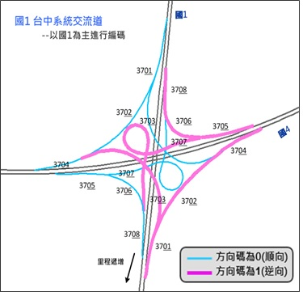
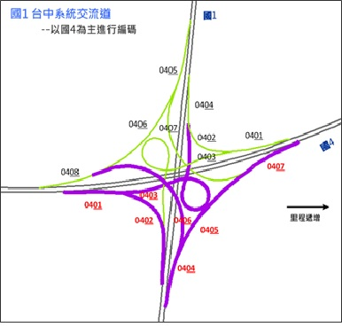

# 序號碼

* 同一道路多線段組成者依序編號給予唯一值。

  

  

* 序號碼\(含備用碼\)：5碼，指同名道路之路段次序。

  __1. 公路__：以**里程**編碼，AAABB。

   \(1\) AAAK+BB里程紀錄至10公尺

   \(2\) 異動直接以里程表示新的段點，故仍具路段次序的特性。

  __2. 市區道路__：以**流水號**編碼，AAAAB，B為異動備用碼。

   \(1\) 編碼序號以00000,00010,00020……，可視為1組十位數號碼。

   \(2\) 異動時啟動個位數序號，以保持路段次序的特性。

  __3. 匝道__：以**流水號**編碼，AABBC。

   \(1\) AA為交流道編號，BB為匝道流水號，C為異動備用碼。

   \(2\) 編碼序號以01000,01010,01020,……，可視為1組十位數號碼。

   \(3\) 異動時啟動個位數序號之異動備用碼作業原則，以保持路段次序。

  __4. 市區道路序號碼內之「異動備用碼」__：AAAAB，B為異動備用碼。

   \(1\) 為1碼數字，市區道路路段更新時使用，其與序號碼最後一碼可視為1組十位數號碼，使於節點增刪後仍可顯示路段次序關係。

   \(2\) 新增節點1點時，備用碼為3, 6；新增2點時為3, 6, 8。

   \(3\) 刪除節點1點時，備用碼為前後節點之平均。刪除2節點時則為前後節點之平均再加5。

  

  __5. 序號碼範例__：公路、市區道路、圓環

  

  

  

  __6. 序號碼範例__：高快速公路交流道

   \(1\) 前兩碼為交流道編號，後兩碼為匝道流水號。
   
   \(2\) 遇分叉時右側優先。

   \(3\) 系統交流道歸屬不同交流道分別依原則編號。

  

  
  

  __7. 序號碼範例__：市區快速道路匝道

   \(1\) 前兩碼為市快交流道編號，後兩碼為匝道流水號。
   
   \(2\) 依匝道出入口判斷，先編出口再編入口。

   \(3\) 里程遞增遞減方向判斷，里程遞增先編，反之遞減後編。

  

