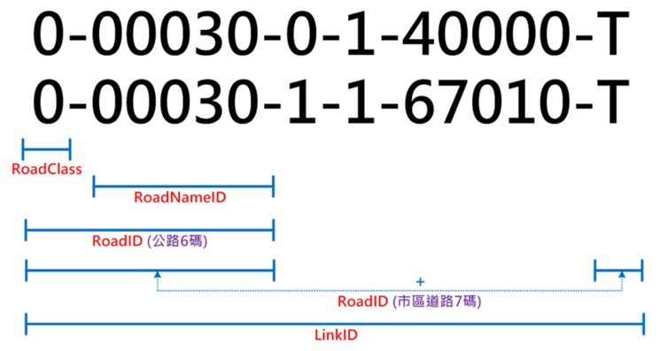
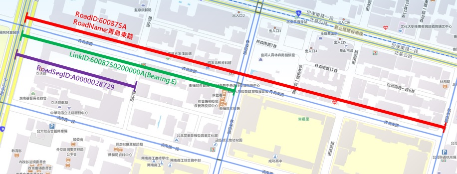

# 補充：RoadID與LinkID關係說明

* LinkID = 基礎路段代碼
* RoadID = 道路代碼

  > 公路\(含市快\)：RoadClass \(1碼\)+RoadNameID\(5碼\)
  >
  > 市區道路：RoadClass \(1碼\)+RoadNameID\(5碼\)+CityID\(1碼\)

# 補充：RoadID/LinkID/RoadSegID關聯示意圖

* RoadID：道路(名稱)代碼（交通資訊基礎路段編碼定義）

* LinkID ：基礎路段代碼（交通資訊基礎路段編碼定義）

* RoadSegID：道路線段（臺灣通用電子地圖定義）
