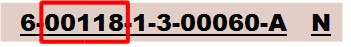

# 路名碼

* 每個道路有其專屬對應名稱與號碼。
* 依道路分類各自編訂路名碼，市區道路又依所屬縣市各自道路名稱筆畫數排序編碼。

  

  

\*無名道路：暫由本案編訂，後續有官方正式公告路名將配合調整

* 路名碼範例

  

  

  

  

  ![]035.jpg)

* 路名碼範例：圓環

  市區道路之圓環通常銜接多條道路，為考量實務上圓環為一完整之道路及路名常用性，使其可於路名碼編列時以其銜接之重要道路名稱由本案暫自行命名編列。

  

  
  

  
